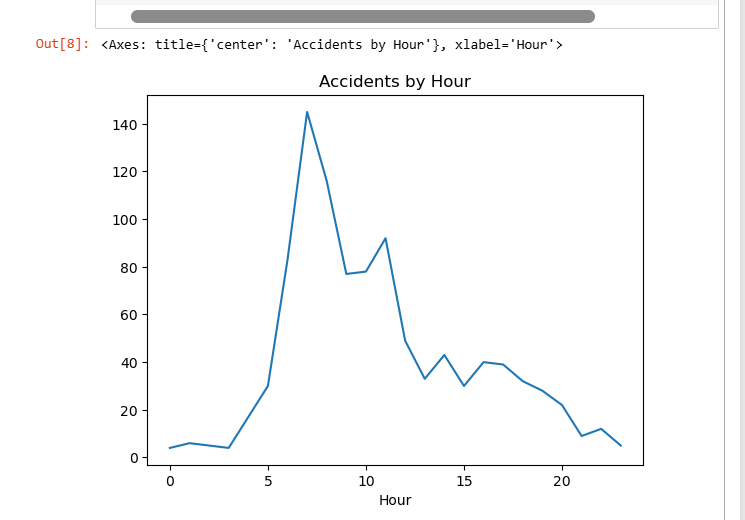
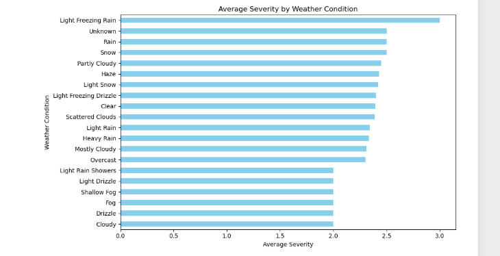
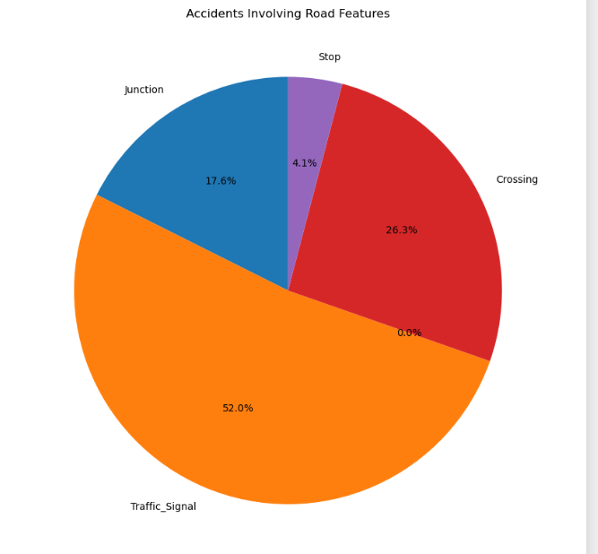
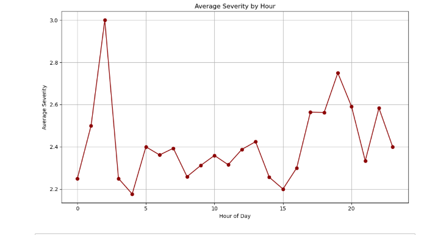
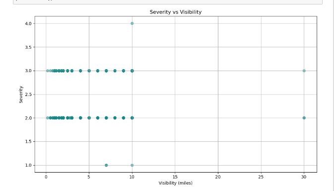
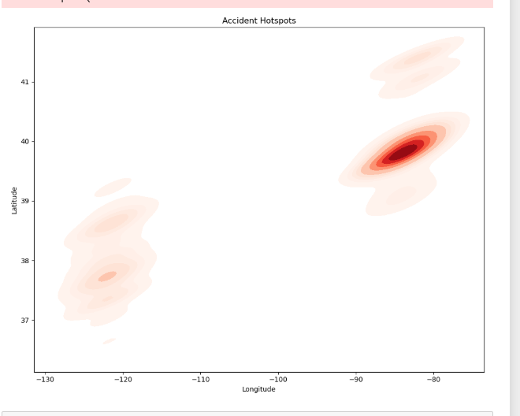

# SCT_DS_Task4_AccidentAnalysis
# Skill Craft Technology Internship — Task 4
*Traffic Accident Data Analysis using Python*
This task focuses on analyzing traffic accident data to uncover patterns related to road conditions, weather, and time of day. The goal is to visualize accident hotspots and contributing factors using Python and Excel.
# Folder Structure
- `task4_accident_analysis/`
  - `data/`
    - `task4.xlsx`: Raw accident dataset
  - `images/`
    - `task4_1.png`: Line chart showing accidents by hour
    - `task4_2.png`: Additional visual (e.g., hotspot or weather impact)
  - `notebook/`
    - `accident_analysis_task4.ipynb`: Jupyter Notebook with full workflow
# Dataset Overview
- **Source**: Accident dataset provided by SkillCraft Technology
- **Key Columns**: `Start_Time`, `Weather_Condition`, `Visibility`, `Severity`, `Temperature`, `Pressure`, `Humidity`, `Wind_Speed`, `Sunrise_Sunset`, etc.
#  Workflow Summary
1. **Data Cleaning**:
   - Parsed datetime columns
   - Extracted hour from `Start_Time`
2. **Exploratory Analysis**:
   - Counted accidents per hour
   - Visualized time-based trends
3. **Visualization**:
   - Line chart showing accident frequency by hour
   - Additional charts for weather, severity, or location-based insights
# Visuals
# 1. Accidents by Hour  

# 2.Average Severity by Weather Condition 

# 3. Accidents Involving Road Features

# 4. Average Severity by Hour

# 5. Severity vs Visibility

# 6. Accident Hotspots

# Key Insight
Accidents peak sharply around **8 AM**, suggesting a strong correlation with morning commute hours. Weather and visibility also show noticeable influence on accident severity.
#Tools Used
- Python (Pandas, Matplotlib)
- Jupyter Notebook
- Excel for initial inspection
- GitHub for version control

### 🚀 Next Steps

Explore geospatial mapping of accident hotspots, analyze severity by weather condition, and build predictive models for accident risk.
